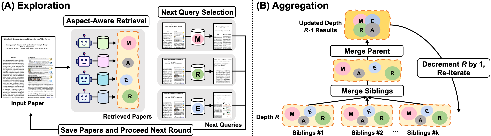

# 🔗 Chain of Retrieval: Multi-Aspect Iterative Search Expansion and Post-Order Search Aggregation for Full Paper Retrieval
[](https://arxiv.org/abs/2507.10057)
[](LICENSE)
[](https://huggingface.co/datasets/Jackson0018/Paper2PaperRetrievalBench)

> *Multi-aspect-guided iterative retrieval framework using full context of scientific papers*
---

## 📘 Overview

**Chain-of-Retrieval (CoR)** is a multi-agent retrieval framework that decomposes a full scientific paper into multiple research aspects — such as *methodology, research questions(motivations), and experimental results* — and performs retrieval via a **chain-of-query** process, while the retrieved results are then hierarchically aggregated to form robust interpretation of dynamic relations between pool of related research by taking the decaying semantic relations with retrieval depth increase.

<p align="center">
  
</p>

---

## 🚀 Setup & Usage

### 🧩 Environment Setup
```bash
git clone https://github.com/psw0021/Chain-of-Retrieval.git
cd Chain-of-Retrieval
conda env create -f environment.yml -n paper_retrieval
conda activate paper_retrieval
mkdir logs
```

```bash
## Optional (If wish to train your custom models)
conda env create -f environment_DPO_train.yml -n DPO_train
```

### 📊 Download Benchmark
```bash
## Download benchmark from the huggingface repository and unzip to current directory
python download_benchmark.py
unzip Paper2PaperRetrievalBench.zip -d .
```

### 🤖 Download Query Optimizers
We release several **DPO-trained query optimizer LLMs** fine-tuned for scientific document retrieval tasks using **Llama-3.2-3B-Instruct** and **Qwen-2.5-3B-Instruct** backbones. Each model is trained with different embedding backends (e.g., Jina-Embeddings-v2-Base-EN, BGE-M3, and Inf-Retriever-v1-1.5B).

---
#### 🦙 Llama-3.2-3B-Instruct Series

| 🤖 Query Optimizer             | 🧠 Embedding Model               | 📦 Preference Set                                                                                                                                                                                                                           | 🤗 Model Card                                                                                           |
|:-----------------------------|:-------------------------------|:------------------------------------------------------------------------------------------------------------------------------------------------------------------------------------------------------------------------------------------|:----------------------------------------------------------------------------------------------------------|
| **Llama-3.2-3B-Instruct**    | **Jina-Embeddings-v2-Base-EN** | [link](https://huggingface.co/datasets/Jackson0018/Preference_Set_Llama-3.2-3B-Instruct_DPO_ref_as_gt_True_IterRet_individual_recall_True_top_k_30)                                                | [Model Card](https://huggingface.co/Jackson0018/Llama-3.2-3B-Instruct_JEmb)                              |
| **Llama-3.2-3B-Instruct**    | **BGE-M3**                     | [link](https://huggingface.co/datasets/Jackson0018/Preference_Set_Llama-3.2-3B-Instruct_BGE_ref_as_gt_True_IterRet_individual_recall_True_top_k_30)                                                | [Model Card](https://huggingface.co/Jackson0018/Llama-3.2-3B-Instruct_BGE)                               |
| **Llama-3.2-3B-Instruct**    | **Inf-Retriever-v1-1.5B**      | [link](https://huggingface.co/datasets/Jackson0018/Preference_Set_Llama-3.2-3B-Instruct_INFV_ref_as_gt_True_IterRet_individual_recall_True_top_k_30)                                               | [Model Card](https://huggingface.co/Jackson0018/Llama-3.2-3B-Instruct_INFV)                              |

---

#### 🐉 Qwen-2.5-3B-Instruct Series

| 🤖 Query Optimizer             | 🧠 Embedding Model               | 📦 Preference Set                                                                                                                                                                                                                           | 🤗 Model Card                                                                                           |
|:-----------------------------|:-------------------------------|:------------------------------------------------------------------------------------------------------------------------------------------------------------------------------------------------------------------------------------------|:----------------------------------------------------------------------------------------------------------|
| **Qwen-2.5-3B-Instruct**     | **Jina-Embeddings-v2-Base-EN** | [link](https://huggingface.co/datasets/Jackson0018/Preference_Set_Qwen2.5-3B-Instruct_JEmb_ref_as_gt_True_IterRet_individual_recall_True_top_k_30)                                                 | [Model Card](https://huggingface.co/Jackson0018/Qwen2.5-3B-Instruct_JEmb)                               |
| **Qwen-2.5-3B-Instruct**     | **BGE-M3**                     | [link](https://huggingface.co/datasets/Jackson0018/Preference_Set_Qwen2.5-3B-Instruct_BGE_ref_as_gt_True_IterRet_individual_recall_True_top_k_30)                                                 | [Model Card](https://huggingface.co/Jackson0018/Qwen2.5-3B-Instruct_BGE)                                |
| **Qwen-2.5-3B-Instruct**     | **Inf-Retriever-v1-1.5B**      | [link](https://huggingface.co/datasets/Jackson0018/Preference_Set_Qwen2.5-3B-Instruct_INFV_ref_as_gt_True_IterRet_individual_recall_True_top_k_30)                                                | [Model Card](https://huggingface.co/Jackson0018/Qwen2.5-3B-Instruct_INFV)                               |
---


```bash
## download uploaded query optimizers from the huggingface repository
mkdir Models
python download_query_optimizers.py
```

### 🪄 Run Evaluation using Llama-based DPO-trained Query Optimizers
- When using trained Query optimizers, use SciFullBench to test its performance. 
- To evaluate the performance of DPO-trained Llama Query Optimizers, deploy each aspect-aware query optimizer agents on separate GPUs using VLLM.

```bash
## create separate session to deploy method agent(optional)
tmux new -s deploy_vllm_method_agent
conda activate paper_retrieval
bash Scripts/deploy_vllm_method_agent.sh
```

```bash
## create separate session to deploy experiment agent(optional)
tmux new -s deploy_vllm_experiment_agent
conda activate paper_retrieval
bash Scripts/deploy_vllm_experiment_agent.sh
```

```bash
## create separate session to deploy research question agent(optional)
tmux new -s deploy_vllm_research_question_agent
conda activate paper_retrieval
bash Scripts/deploy_vllm_research_question_agent.sh
```

```bash
## create separate session to run inference(optional)
tmux new -s paper_retrieval
## activate paper retrieval background if not activated
conda activate paper_retrieval

## make logs directory for initial trial
mkdir logs/logs
bash Scripts/inference_QoA_parallel_ai.sh
```

### 🪄 Run Evaluation using QWEN-based DPO-trained Query Optimizers
- When using trained Query optimizers, use SciFullBench to test its performance. To evaluate the performance of DPO-trained QWEN Query Optimizers, deploy each aspect-aware query optimizer agent separately using VLLM.
- To evaluate the performance of DPO-trained Llama Query Optimizers, deploy each aspect-aware query optimizer agents on separate GPUs using VLLM.

```bash
## create separate session to deploy method agent(optional)
tmux new -s deploy_vllm_method_agent_QWEN
conda activate paper_retrieval
bash Scripts/deploy_vllm_method_agent_QWEN.sh
```

```bash
## create separate session to deploy experiment agent(optional)
tmux new -s deploy_vllm_experiment_agent_QWEN
conda activate paper_retrieval
bash Scripts/deploy_vllm_experiment_agent_QWEN.sh
```

```bash
## create separate session to deploy research question agent(optional)
tmux new -s deploy_vllm_research_question_agent_QWEN
conda activate paper_retrieval
bash Scripts/deploy_vllm_research_question_agent_QWEN.sh
```

```bash
## create separate session to run inference (optional)
tmux new -s paper_retrieval
## activate paper retrieval background if not activated
conda activate paper_retrieval

## make logs directory for initial trial
mkdir logs/logs
bash Scripts/inference_QoA_parallel_ai.sh
```

### 🪄 Run Evaluation using untrained Query Optimizers on SciFullBench
```bash
## Optional, if using GPT-based Query Optimizers
export OPENAI_API_KEY="<YOUR OPENAI API KEY>"
## make logs directory for initial trial
mkdir logs/logs
bash Scripts/inference_QoA_parallel_ai.sh
```

### 🪄 Run Evaluation using untrained Query Optimizers for PatentFullBench
```bash
export OPENAI_API_KEY="<YOUR OPENAI API KEY>"
## make logs directory for initial trial
mkdir logs/logs_patents
bash Scripts/inference_QoA_parallel_patents.sh
```

### 🪄 How to reproduce results using SciMult
- To reproduce retrieval performance using SciMult embedding model, you must create separate conda environment following the instructions provided in the below repository
- **SciMult Repository** [https://github.com/yuzhimanhua/SciMult](https://github.com/yuzhimanhua/SciMult)

```bash
mkdir logs/logs_scimult
bash Scripts/inference_QoA_parallel_ai_SciMult.sh
```

### 🪄 Manually Create Preference Set
#### Download TrainSet/Citation Information
```bash
## Download train set for rollout from the huggingface repository and unzip.
cd Train
python download_trainset.py
unzip Final_Train_Set.zip -d Train_Dataset/
```

```bash
## Download raw semantic scholar information for rollout from the huggingface repository and unzip.
cd Train. ## If currently not in Train subdirectory. 
python download_citation_info.py
unzip Raw_Train_Dataset.zip -d .
```

#### Run Rollout to Create Self-Generated Preference Set 
```bash
## Fill out the script file according to your needs and run roll out script file.
conda activate paper_retrieval
mkdir logs ## If logs directory do not exist(optional).
bash Train_Dataset/Scripts/roll_out_parallel.sh
```

#### Create Preference Set using Self-Generated Rollout Data
```bash
## Set model and embedding model configurations you used for rollout properly into the config arguments in Train_Dataset/Create_Preference_Dataset/create_preference_dataset.py file.
python Train_Dataset/Create_Preference_Dataset/create_preference_dataset.py
```

### 🪄 Train Using Preference Set
```bash
## If currently not in Train subdirectory(optional)
cd Train
conda activate DPO_train
```

```bash
## Train DPO method agent(optional)
bash Train/DPO_unsloth/DPO_train_method_agent.sh
```

```bash
## Train DPO experiment agent(optional)
bash Train/Train/DPO_unsloth/DPO_train_experiment_agent.sh
```

```bash
### Train DPO research question agent(optional)
bash Train/Train/DPO_unsloth/DPO_train_research_question_agent.sh
```

### 📜 Citation
If you find our research useful, please cite our paper.

```bibtex
@article{park2025chain,
  title={Chain of Retrieval: Multi-Aspect Iterative Search Expansion and Post-Order Search Aggregation for Full Paper Retrieval},
  author={Park, Sangwoo and Baek, Jinheon and Jeong, Soyeong and Hwang, Sung Ju},
  journal={arXiv preprint arXiv:2507.10057},
  year={2025}
}

